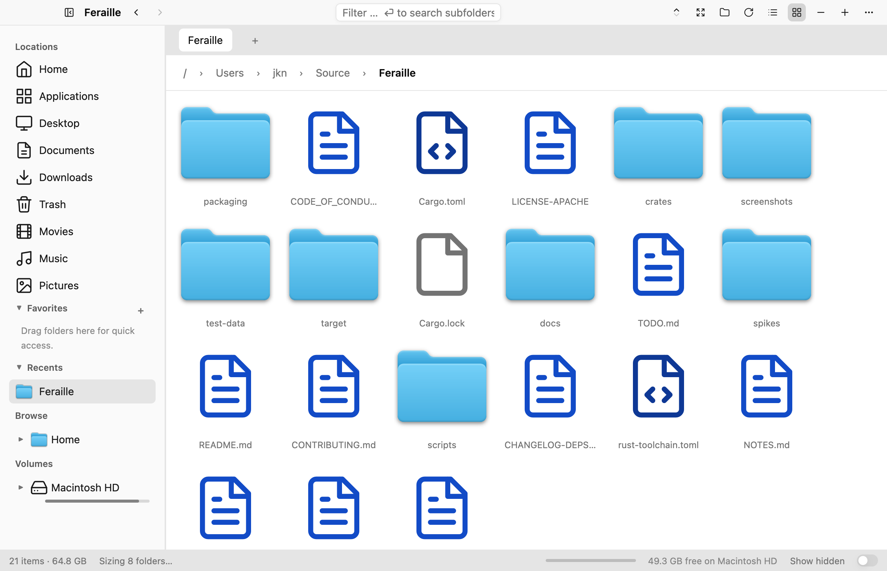
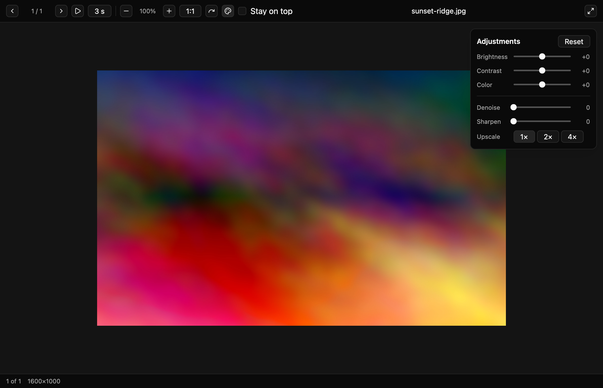
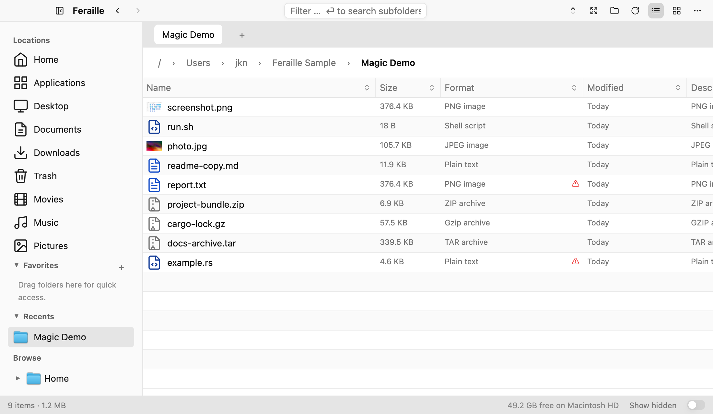

# Feraille

**A fast, native cross-platform file manager written in Rust — macOS and
Windows, with Linux possibly to follow.**

Feraille is built on [GPUI](https://www.gpui.rs/) and
[gpui-component](https://github.com/longbridge/gpui-component). It began as a
successor to the Windows project `Ferail`, but it is not a reskin: the UI,
native shell integration, and responsiveness model are designed for each
platform. The macOS app is the furthest along; the Windows port is in active
development (see [docs/features/windows-port.md](docs/features/windows-port.md)),
and Linux may come later (a starting orientation lives in
[docs/features/linux-port.md](docs/features/linux-port.md)).

> ### 🤖 Built with AI — and accepting AI pull requests
>
> Feraille is, by design, **mostly "vibe-coded"**: the bulk of it was written
> through AI pair-programming rather than typed by hand. That's not a caveat,
> it's the workflow.
>
> **AI-generated pull requests are welcome and encouraged.** Point your agent
> at [CLAUDE.md](CLAUDE.md) (the operating manual for AI/human contributors)
> and [docs/ARCHITECTURE.md](docs/ARCHITECTURE.md), keep the prime directive
> below, and run `cargo check` / `cargo test` before opening the PR. Human
> review still gates every merge.

One rule shapes the whole design — **the UI must never stop:**

> Render, hit testing, scrolling, hover, and text input never perform
> filesystem, shell, database, network, thumbnail, preview, or
> magic-sniffing I/O. Expensive work is scheduled off the hot path and
> dropped if the user has already moved on.

See [Architecture → Prime Directive](docs/ARCHITECTURE.md#prime-directive)
for how this is enforced across the codebase.


## Features

- **Native window chrome** — GPUI title bar, transparent titlebar, system
  theme (macOS today; matching Windows chrome is in progress).
- **Virtualized file table** — sortable, resizable, reorderable columns over
  large directories without jank.
- **List & icon views** — switch any tab between the dense table and a
  Finder-style icon grid.
- **Magic-first `Format` column** — content sniffing with extension fallback
  and mismatch / quarantine cues.
  ([spec](docs/features/MAGIC_DESCRIPTION.md))
- **Rich sidebar** — Favorites, Browse tree, Volumes with capacity bars, and
  Trash, with drag-and-drop. ([spec](docs/features/FAVORITES.md))
- **Tabs & windows** — per-tab directory, history, filter, sort, and selection;
  multi-window with closed-tab undo.
  ([spec](docs/features/feraille-windows-instances-tabs-spec.md))
- **Preview pane** — dense, async metadata surface for the current selection.
  ([spec](docs/features/PREVIEW.md))
- **Media viewer** — built-in image and video viewer with live colour,
  sharpen, denoise, and upscale adjustments; VLC-backed for any-format video.
  ([spec](docs/features/VIEWER.md))
- **Disk Usage window** — async scanning with squarified treemap and top-list
  views. ([spec](docs/features/DISK_USAGE.md))
- **Persistent metadata** — SQLite-backed store for derived metadata, layout,
  and Ant Trail history. ([spec](docs/features/METADATA_DB.md))
- **CLI utilities** and **headless screenshots** for scripting and visual
  verification.

| Preview pane | Disk Usage | Settings |
|---|---|---|
|  |  |  |
| **Icon view** | **Media viewer** | **Magic & mismatch** |
|  |  |  |

## How Feraille Compares

Feraille is a **power-user file manager** that optimizes for two things the
default managers treat as afterthoughts: **responsiveness under load** (the
prime directive above) and **content intelligence** (magic detection, built-in
disk usage, predictive navigation, a duplicate finder). It reuses the good OS
plumbing where it exists — Quick Look, Spotlight, system tags, quarantine on
macOS — and builds in the power tools you'd otherwise install separately.

It is also young and single-developer, so it trades maturity for focus. The
table below is an honest scorecard, not a victory lap — the ❌ rows are real
gaps. Status reflects
the furthest-along platform; the Windows port is
[in progress](docs/features/windows-port.md) and there is no Linux build yet
([orientation only](docs/features/linux-port.md)).

| Capability | Feraille | Finder (macOS) | File Explorer (Windows) | Dolphin / Nautilus (Linux) |
|---|---|---|---|---|
| **Never-block UI on slow / network I/O** | ✅ design invariant | ❌ beachballs | ❌ hangs | ⚠️ varies |
| **Content / magic detection** (sniff bytes, not extension) | ✅ | ❌ | ❌ | ⚠️ MIME |
| **Built-in disk usage** (treemap) | ✅ | ❌ (3rd-party) | ❌ (3rd-party) | ⚠️ separate app |
| **Built-in duplicate finder** | ✅ size→hash funnel, cached, hard-link aware | ❌ (3rd-party) | ❌ (3rd-party) | ❌ (3rd-party) |
| **Predictive prewarming** (navigation heat / hover) | ✅ Ant Trail | ❌ | ❌ | ❌ |
| **Previews** | ✅ Quick Look + inline syntax-highlighted text/code/markdown | ✅ Quick Look | ⚠️ preview pane | ✅ Dolphin strong |
| **Tabs + multi-window + split** | ✅ tabs + multi-window | ⚠️ tabs, no split | ⚠️ tabs (recent) | ✅ Dolphin best-in-class |
| **Command palette** | ✅ Cmd+K | ❌ | ❌ | ❌ |
| **Global / indexed search** | ⚠️ basic — rides Spotlight, walker fallback; single query box | ✅ Spotlight (rich) | ✅ indexed | ✅ Tracker / Baloo |
| **Cloud integration** (iCloud / OneDrive / Drive) | ⚠️ detects placeholders | ✅ deep | ✅ deep | ⚠️ |
| **Network / SMB browse & mount** | ⚠️ mounted shares only | ✅ | ✅ | ✅ Dolphin KIO |
| **3rd-party shell-extension verbs** | ❌ (built-ins + Open With) | ✅ Services | ✅ large ecosystem | ✅ service menus |
| **Accessibility / localization / maturity** | ❌ young, single-dev | ✅ decades | ✅ decades | ✅ mature |

✅ first-class · ⚠️ partial / varies · ❌ absent

**Why you'd choose it:** Feraille is a *fresh, fast, cross-platform* file
manager — modern from the ground up rather than a decades-old default carried
forward. It refuses to beachball (the prime directive), and it ships the power
tools you'd otherwise install one-by-one: a **duplicate finder** (no mainstream
default file manager has one), a disk-usage treemap, magic-byte content
detection, predictive navigation, and a command palette — in one app, on every
platform it targets.

**Honest about the young parts.** It's one developer building in the open, so
some things are deliberately still simple. Search works and rides Spotlight,
but today it's a single query box — saved smart folders, filter chips, and
live-updating results are on the roadmap. The duplicate finder finds and groups
well; a bulk-cleanup view (keep-newest, select-all-but-one) is next. Deep
cloud / network integration and the polish of a shipping-for-decades product
aren't there yet either.

The pitch is simple: if you want a file manager that's **new, quick, and the
same everywhere** — and that builds in the tools power users reach for — rather
than whatever came with your OS, that's Feraille.

## Quick Start

```sh
# Run the app
cargo run --bin feraille-gpui

# Build a signed .app bundle so macOS shows the normal access prompts
# (Documents/Desktop/Downloads/removable/network) instead of failing.
# The loose binary above can't prompt — see the script header for why.
scripts/bundle-mac.sh && open target/Feraille.app

# CLI utilities
cargo run --bin feraille -- magic <path>...                    # identify file types
cargo run --bin feraille -- du [--top N] [--packages] <path>   # disk usage

# Headless screenshot (used for visual verification)
cargo run --bin feraille-gpui -- \
  --screenshot screenshots/feraille.png \
  --navigate . \
  --width 1400 --height 900 \
  --select-name Cargo.toml --preview

# Reset local metadata
cargo run --bin feraille-gpui -- --reset-db <scope>
```

## macOS Permissions (Access Prompts)

macOS gates the protected folders (Desktop, Documents, Downloads,
removable volumes, network volumes, cloud providers) behind its privacy
system (TCC). The familiar *"Feraille would like to access files in your
Documents folder"* prompt only appears when **all** of these hold:

1. the path is in one of those promptable categories (arbitrary folders
   are never promptable — they need Full Disk Access);
2. Feraille runs as a code-signed `.app` bundle with a stable identity;
3. that bundle's `Info.plist` declares the matching `NS*UsageDescription`
   string ([packaging/macos/Info.plist](packaging/macos/Info.plist)).

The loose `cargo run` binary meets none of these — it inherits the
terminal's privacy identity and has no usage strings — so a denied read
just shows the in-app "Access required" screen that deep-links to Full
Disk Access. To get the real prompts, build and run the bundle:

```sh
scripts/bundle-mac.sh && open target/Feraille.app
```

Caveats:

- **Stale grants from terminal runs.** Earlier `cargo run` sessions
  attribute grants/denials to *Terminal*, not Feraille. If the bundle
  doesn't prompt, clear the stale state:

  ```sh
  tccutil reset SystemPolicyRemovableVolumes me.jkn.feraille
  tccutil reset SystemPolicyDocumentsFolder  me.jkn.feraille
  ```

- **Ad-hoc signing doesn't persist.** The default ad-hoc signature
  changes every build, so macOS treats each build as a new app and
  re-prompts. For grants that stick across rebuilds, sign with a real
  identity:

  ```sh
  CODESIGN_IDENTITY="Developer ID Application: …" scripts/bundle-mac.sh
  ```

- **After a denial, macOS never re-prompts.** Once you click "Don't
  Allow", the only recourse is the in-app "Open Full Disk Access
  settings" link (also the path for arbitrary, non-promptable folders).

## Project Layout

The active app is `feraille-gpui`. Domain logic lives in UI-free crates.

| Crate | Responsibility |
|---|---|
| `feraille-gpui` | Active GPUI app + CLI entry points; views, actions, scheduling, shell state |
| `feraille-core` | Platform-neutral domain types, command catalogue, `NodeId`, `FileEntry` |
| `feraille-fs-native` | Native filesystem: enumeration, metadata, magic, volumes, trash |
| `feraille-shell-mac` | AppKit/Cocoa integration (drag-drop, menus, tags, icons) — no painting |
| `feraille-meta` | SQLite-backed metadata, layout, and Ant Trail persistence |
| `feraille-disk-usage` | Pure disk-usage model, aggregation, and treemap layout |
| `feraille-design` | Shared design tokens (color, spacing, typography) |
| `feraille-shell-win32` | Windows shell reference crate (not macOS v1 UI) |

The full crate-boundary rules are in
[docs/ARCHITECTURE.md → Crate Boundaries](docs/ARCHITECTURE.md#crate-boundaries).

## Documentation

| Document | Purpose |
|---|---|
| [docs/ARCHITECTURE.md](docs/ARCHITECTURE.md) | **Source of truth** for crate boundaries, data model, scheduling, and UI structure. Read before changing those. |
| [TODO.md](TODO.md) | Open work and roadmap. |
| [docs/features/](docs/features/README.md) | Deeper design notes per feature — start at the [feature index](docs/features/README.md). |
| [NOTES.md](NOTES.md) | Architecture and decision log for in-progress spec work. |
| [CLAUDE.md](CLAUDE.md) | Operating manual for AI/human contributors. |

## Contributing

See [CONTRIBUTING.md](CONTRIBUTING.md) for the full guide. **AI-generated PRs
are welcome** — point your agent at [CLAUDE.md](CLAUDE.md) first. In short:

- New product work belongs in `crates/feraille-gpui`.
- Domain code belongs in `feraille-core`, `feraille-fs-native`,
  `feraille-meta`, or `feraille-disk-usage` whenever it can stay UI-free.
- Before finishing changes: `cargo check`, `cargo test`, and for UI changes a
  fresh screenshot in `screenshots/`. See [CLAUDE.md](CLAUDE.md#verification).
- Do not run broad formatters casually; this repo often has local work in
  progress.

## License

Dual-licensed under either of

- MIT license ([LICENSE-MIT](LICENSE-MIT))
- Apache License, Version 2.0 ([LICENSE-APACHE](LICENSE-APACHE))

at your option.

> **Note:** Feraille depends on `gpui` / `gpui-component` as git
> dependencies (they are not published to crates.io), so the crates are not
> on crates.io and there is no `cargo install`. Build from source with
> `cargo run --bin feraille-gpui`; reproducible builds come from the
> committed `Cargo.lock`.
