# Ferail - Feature Tour

← [README](../README.md) · [Getting started](../GETTING_STARTED.md) ·
[Architecture](ARCHITECTURE.md) · [Design notes per feature](features/README.md)

Everything the app does today, with pictures. Each section links to the
deeper design note where one exists. If you only read one thing: Ferail
is a file manager that **never blocks**: every feature below is built on
that rule.

---

<!-- toc depth=2 -->

- [The shell - a file table that keeps up with you](#the-shell---a-file-table-that-keeps-up-with-you)
- [Descriptions - what a file *is*, not what it claims](#descriptions---what-a-file-is-not-what-it-claims)
- [Filename hazards - names that can't lie](#filename-hazards---names-that-cant-lie)
- [SHA-256 - verify a download in place](#sha-256---verify-a-download-in-place)
- [Archives - open them like folders](#archives---open-them-like-folders)
- [Ant Trail - the app learns where you go](#ant-trail---the-app-learns-where-you-go)
- [Icon grid - the same folder, visual](#icon-grid---the-same-folder-visual)
- [Media viewer - compare files like frames](#media-viewer---compare-files-like-frames)
- [Disk Usage - see the bytes, act on them, share the picture](#disk-usage---see-the-bytes-act-on-them-share-the-picture)
- [Exact duplicates and similar images - built in, private](#exact-duplicates-and-similar-images---built-in-private)
- [Bulk rename - regex power with a live preview](#bulk-rename---regex-power-with-a-live-preview)
- [Search - streaming results, Spotlight-backed](#search---streaming-results-spotlight-backed)
- [Flat View - every subfolder, one list](#flat-view---every-subfolder-one-list)
- [Command palette & shortcuts](#command-palette--shortcuts)
- [Settings & themes](#settings--themes)
- [The command line - the same binary, without the window](#the-command-line---the-same-binary-without-the-window)
- [The quiet features you'll feel](#the-quiet-features-youll-feel)
- [Make it yours](#make-it-yours)
- [Editors, for the small fixes](#editors-for-the-small-fixes)
- [Where the project is](#where-the-project-is)

<!-- /toc -->

## The shell - a file table that keeps up with you

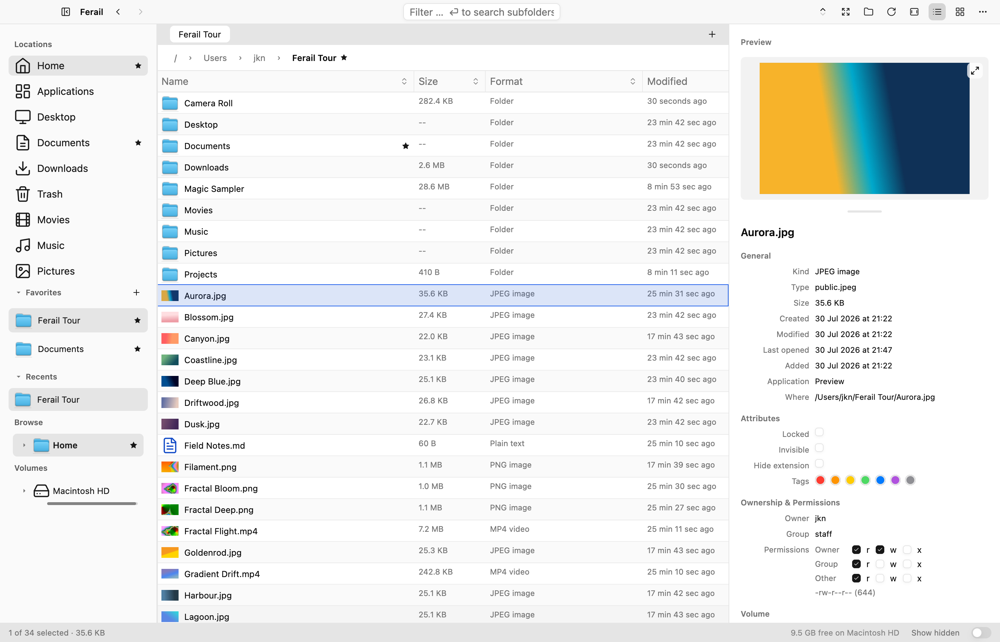

- **Virtualized table** over directories of any size: sort, resize, and
  reorder columns (your layout persists across launches), filter as you
  type, and stream huge folders in without a frozen frame.
- **Format column reads bytes, not extensions**: over 110 recognized formats
  with structured parsers (executables, archives, images, audio, video),
  so a `.jpg` that's secretly a `.zip` is flagged inline, and a
  Description column fills with real facts (bitness/arch, dimensions,
  channels/kHz/duration). ([magic notes](features/MAGIC_DESCRIPTION.md))
- **Inspector-grade preview pane**: Quick Look media or syntax-highlighted
  text, plus the full Get Info surface: dates, tags, POSIX permission
  grid, volume, all editable, all gathered off-thread.
  ([preview](features/PREVIEW.md))
- **Finder-parity essentials**: color tags, quarantine badges with
  "where from" provenance, hidden-file toggle, per-tab history,
  drag-and-drop in and out, undoable operations (Cmd+Z), and a
  deceptive-filename highlighter that catches `раypal.exe`-style
  homoglyph tricks without flagging normal Cyrillic/Greek names.

## Descriptions - what a file *is*, not what it claims

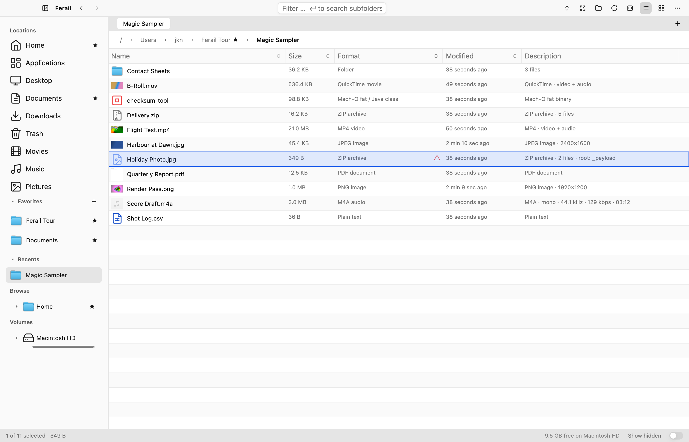

Every file is identified by its **bytes, not its extension**, and the
facts land in a Description column: image dimensions, audio channels /
sample rate / bitrate / duration, archive entry counts and root folder,
Mach-O and ELF architecture. Folders share the column with recursive
item counts. When the content and the extension disagree the row is
flagged: above, `Holiday Photo.jpg` is really a ZIP, and says so.
([magic description](features/MAGIC_DESCRIPTION.md) ·
[magic sniffing](features/MAGIC_SNIFFING.md))

## Filename hazards - names that can't lie

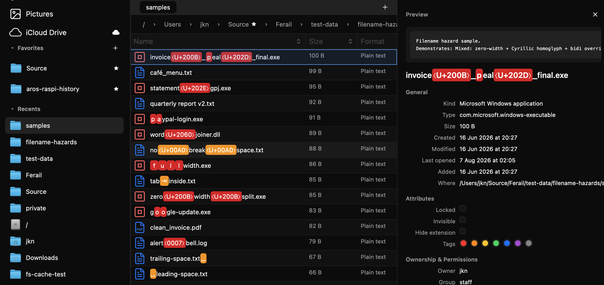

A filename can pretend to be something it isn't: a zero-width space
buried in `invoice_…_final.exe`, a bidi override that reverses the
visible extension, a Cyrillic `а` standing in for a Latin one in
`pаypal-login`, a run of padding that pushes `.exe` out of sight. Every
display name is pre-scanned off-thread, and what's actually there is
what gets drawn: invisible characters become explicit `⟨U+200B⟩`-style
chips, homoglyphs and disguised whitespace are highlighted in place.
The name you read is the name you have.

## SHA-256 - verify a download in place

Select one file and choose **Generate SHA-256…** from its context menu, the
File menu, or Cmd+K. Ferail streams the file off the UI thread with visible,
cancellable progress and a one-click **Copy** action. If the clipboard already
contains a SHA-256, including the common `hash  filename` or
`SHA256(filename) = hash` forms: the dialog trims surrounding whitespace and
compares it automatically. The expected value remains editable; **Clear**
removes it from this dialog without touching the system clipboard.
([checksum notes](features/CHECKSUMS.md))

## Archives - open them like folders

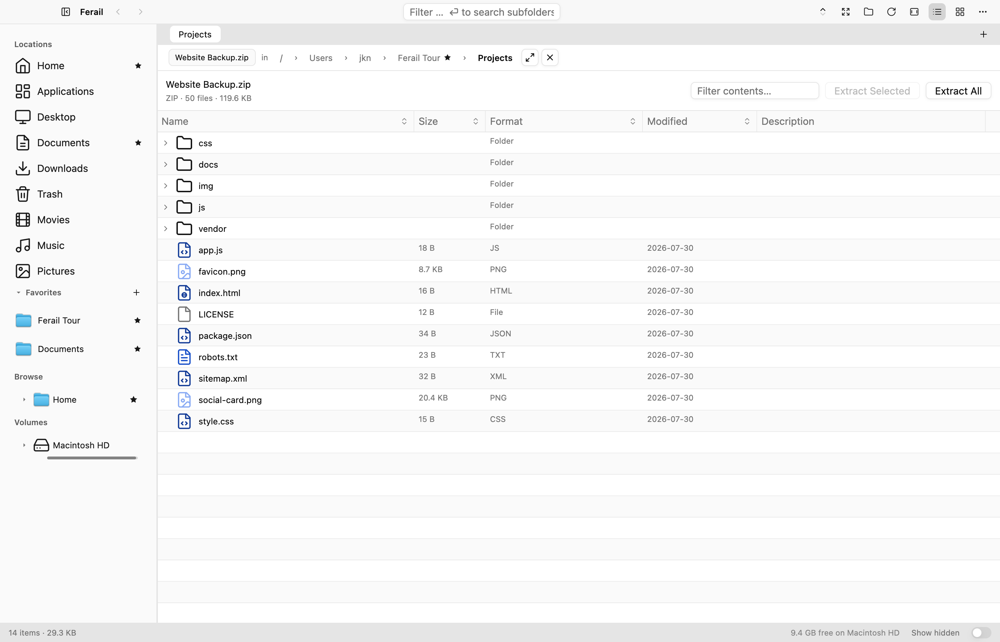

Open a `.zip`, `.7z` or `.tar.*` in place and browse it as a real
sortable list, expandable folders, the usual columns, a filter box, so
a 5000-entry archive opens as one folder to drill into instead of 5000
rows. Extract everything or just the selection (a selected folder brings
its subtree). Plain ZIP files can be edited as a transaction: dropping files
or folders, renaming entries, and removing subtrees updates a projected view;
**Save Changes** validates a replacement before atomically committing it, and
**Revert** abandons the whole journal. A stale file, cancellation, or failed
write never replaces the original. The Description column also shows packed
size, compression method, checksum, stored permissions, encryption, and entry
comments when available. It works on anything that *is* an archive underneath,
even without the extension, `.docx`, `.jar`, `.apk`: but those ZIP-based
packages and formats without a safe writer stay read-only. Their drag targets
show a lock badge, a forbidden cursor, and the reason. The workbench pops out
into its own window, like Disk Usage, and warns before closing with unsaved
changes. **Convert Archive…** makes a new ZIP, 7-Zip, TAR, TAR.GZ, TAR.BZ2, or
TAR.XZ beside the source, validates it, and never overwrites the original.
Renamed compressed TAR downloads such as `backup.tar (1).gz` are recognized by
their decoded header and show the TAR tree instead of one opaque member. On
macOS, members drag from a popped-out workbench straight to Finder through a
native file promise; extraction begins only after the external drop, never on
the GUI thread. Dropping back on the archive cancels rather than extracting
into the folder behind it.
Stored member names also use the deceptive-filename highlighter before they
are extracted. The complete behavior and safety rules live in the
[detailed archive feature document](features/ARCHIVES.md).

## Ant Trail - the app learns where you go

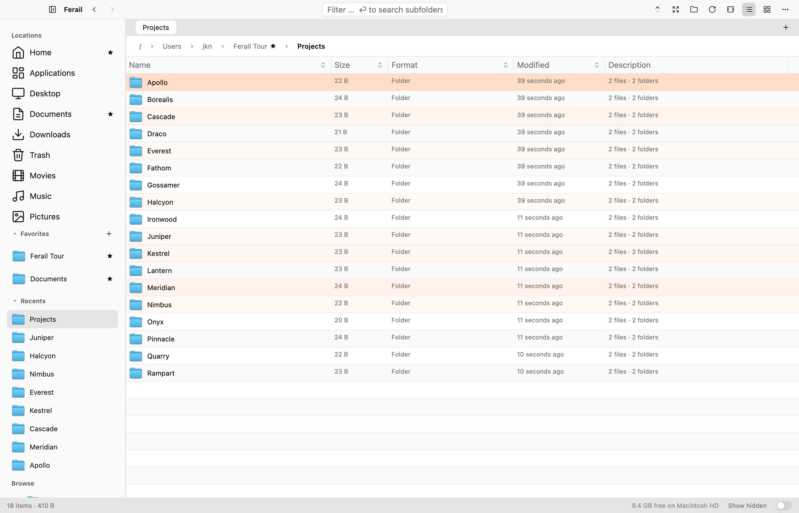

Visit counts are recorded per folder and heat-tint the rows you actually
use, above, the darkest rows are the most-visited projects, while a
Recents section keeps them one click away. Recency and heat are separate,
so clearing Recents doesn't erase how often you visit a folder. Both the
tint and the Recents list have master switches, and the base colour is
configurable in Settings → Appearance. ([ant trail](features/ANT_TRAIL.md))

## Icon grid - the same folder, visual

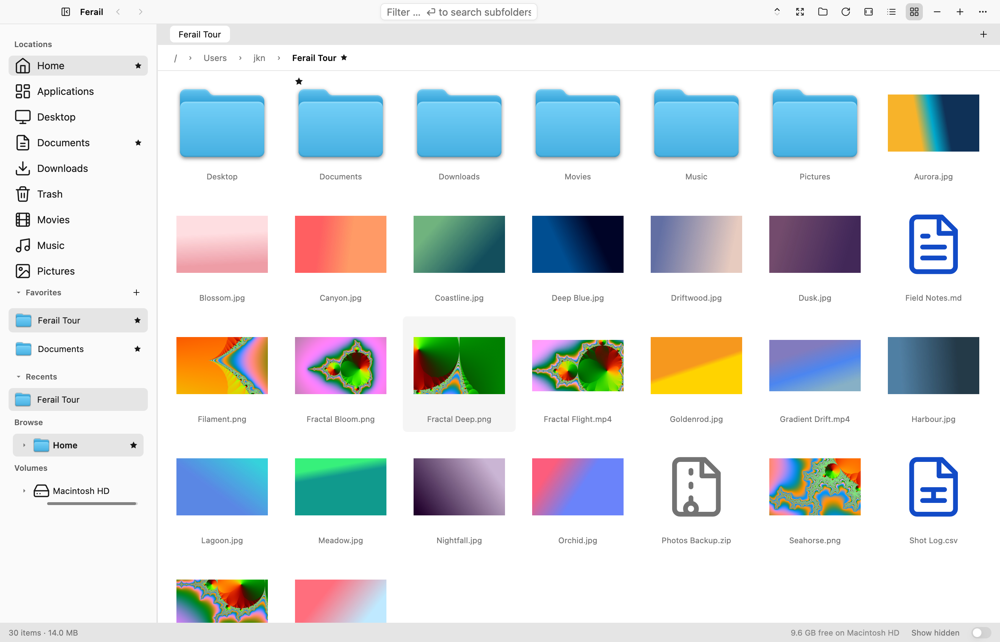

Any tab flips between the dense table and a Finder-style grid
(per-folder, like Finder). Real thumbnails, size slider, and the same
adornments as the list: tag dots, favorite stars, visit-heat tint, cut
dimming. Multi-select with the keyboard or Cmd-click; the same context
menu and drag-out everywhere.

## Media viewer - compare files like frames

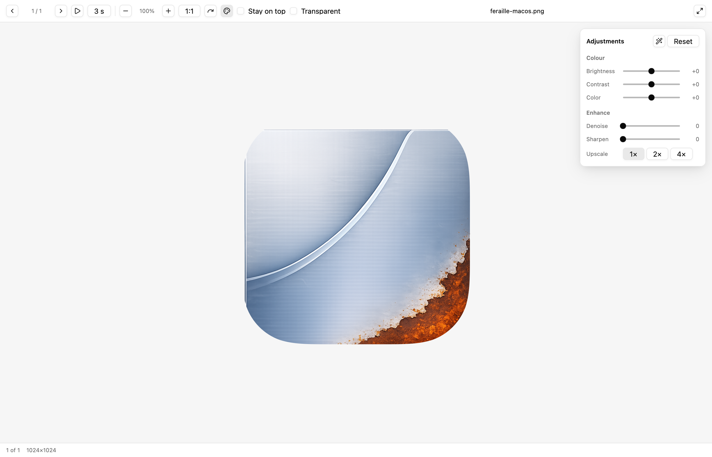

A built-in image *and* video viewer whose party trick is **sticky
zoom**: zoom to 4× on one photo's corner and the next file opens at 4×
on the *same* corner: purpose-built for comparing scans, renders, or
frames. Per-file rotation, slideshow, frame stepping, and a live
adjustment panel (brightness/contrast/saturation, one-click
auto-enhance, SIMD 1×/2×/4× upscale).

With the **mpv backend** it plays virtually any container and grades it
live with no re-encode, plus the showpiece: **chroma-keyed, stackable
transparent video windows** (pick a colour, key it out, float the clip
over your desktop, stack several). Every release build has the backend
compiled in; it loads libmpv from the system at startup, so installing
mpv (`brew install mpv`, `apt install libmpv2`, or the Windows
`libmpv-2.dll` beside the exe) enables it. Without libmpv the viewer
falls back to the platform-native player.
([viewer](features/VIEWER.md) · [video backend](features/VIDEO-MPV.md))

## Disk Usage - see the bytes, act on them, share the picture

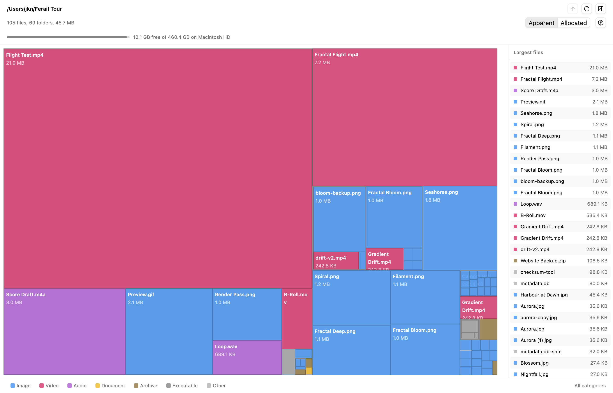

A squarified treemap with async scanning that streams in live, colored
by content category, with a Top-N largest-files panel. It counts
*honestly*: hardlinks once, `du -x` filesystem boundaries with
macOS-firmlink awareness, real rolled-up sizes for `.app` bundles, and
an apparent-vs-on-disk toggle.

It's not just a picture: **multi-select squares and act on them**:
Open, Reveal, Get Info, Copy, Move to Trash (auto-rescans), with full
keyboard support. And when you want to *show* someone: **Export as
HTML** renders the exact same treemap as a self-contained snippet
(no JavaScript) you can paste into any document, wiki, or web page.
([disk usage](features/DISK_USAGE.md))

## Exact duplicates and similar images - built in, private

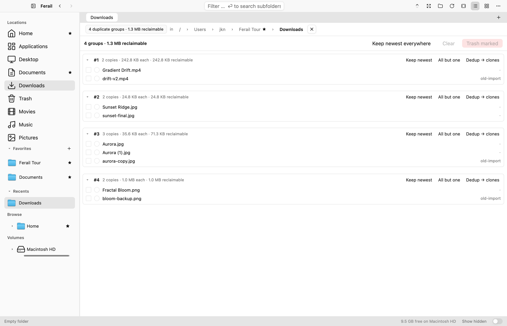

A size→partial-hash→full-hash funnel (BLAKE3, results cached in SQLite
so re-scans are fast) with an optional byte-for-byte paranoid pass that
streams in constant memory. It knows APFS clones and hardlinks don't
free space, so "reclaimable" is a number you can trust. Review groups
in a dedicated panel, mark keepers, trash the rest, or deduplicate
in place with APFS clonefile. ([duplicates](features/DUPLICATES.md))

The same panel can find visually similar PNG, JPEG, GIF, WebP, BMP, and TIFF
images, even after resizing or ordinary recompression. Dual perceptual hashes
separately measure structure and detail; adjust either threshold live, compare
full-size candidates with Space or a double-click, and let Ferail suggest the
highest-resolution original as the keeper. Reclaimable space updates with your
choice, and similar files can only go through the recoverable Trash flow:
byte-replacing clone dedup is deliberately unavailable.

Personal pictures stay private. Pixels, paths, perceptual signatures, and
result thumbnails remain local, are never sent over the network or written to
the metadata database, and disappear with the active scan, result tab, or
viewer.

## Bulk rename - regex power with a live preview

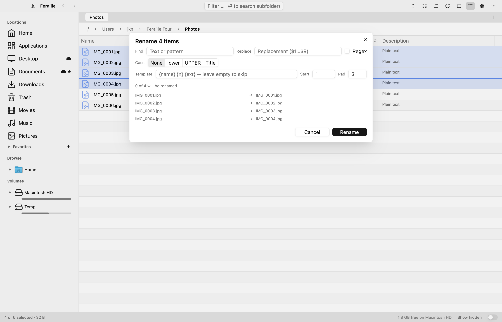

Select the files, right-click → *Rename N Items…*: literal or regex
find/replace (with `$1` captures), case transforms, and a template
stage with `{name}` `{ext}` `{n}` `{date}` tokens for numbering. The
before→after preview updates live, conflicts block the button before
anything touches disk, renumbering chains and swaps execute in
dependency order, and the whole batch is one Cmd+Z away from undone.
([bulk rename](features/BULK_RENAME.md))

## Search - streaming results, Spotlight-backed

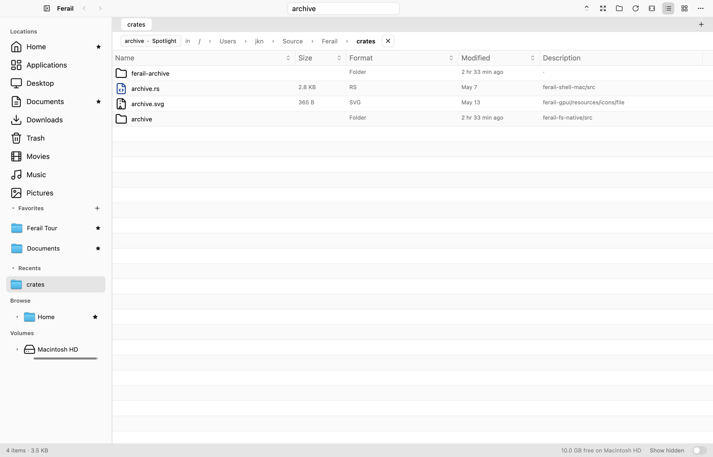

Recursive search of the current folder or the whole volume, streaming
results into a live tab as they're found. Rides Spotlight when
available, with a walker fallback that works anywhere (and is the
Windows/Linux path today). ([search](features/SEARCH.md))

## Flat View - every subfolder, one list

The third view button turns the current location into a files-only recursive
snapshot without changing the familiar list UI. Results stream as Ferail walks
the tree, the breadcrumb reports files and folders scanned, and the task can be
cancelled or refreshed. A sortable **Path** column shows each parent relative
to the root; the filter works over the completed snapshot without rereading the
disk. There is no fixed row cap, and the scan-local path arena is discarded
when the view closes instead of retaining personal paths process-wide.
([Flat View notes](features/FLAT_VIEW.md))

## Command palette & shortcuts

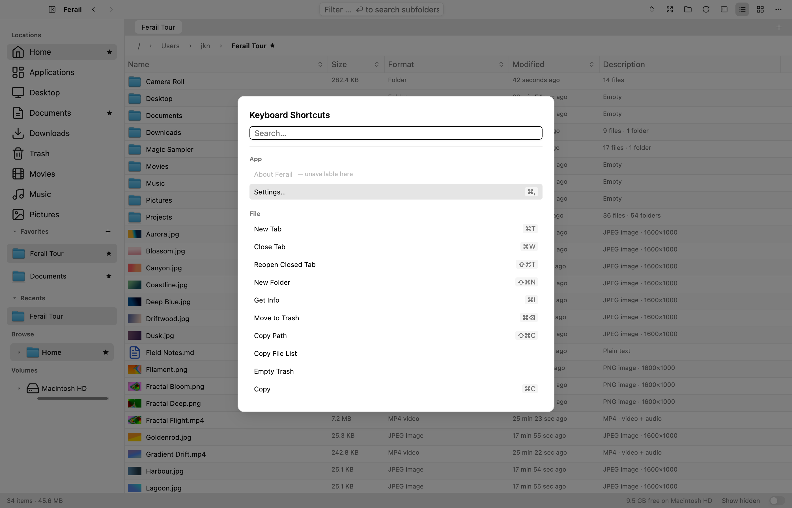

Cmd+K opens a searchable overlay of every command and its shortcut,
one identity layer (`ferail-core`'s command catalogue) drives the
palette, the macOS menu bar, and the keybindings, so they can't drift
apart.

## Settings & themes

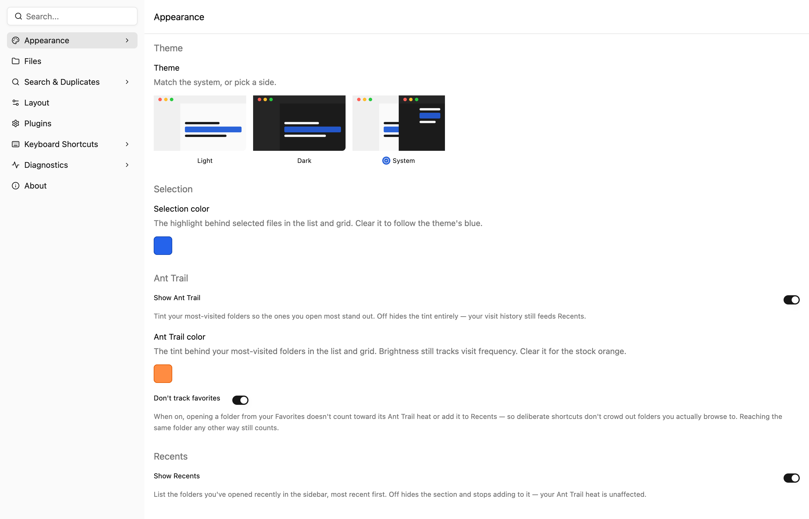

Searchable settings with light/dark/system themes, selection and
heat-tint accent colors, UI zoom (Cmd+= / Cmd+-), thumbnail and
recents toggles, search/duplicate-finder tuning, and a diagnostics
page with a privacy-redacted "copy report" for bug reports.

## The command line - the same binary, without the window

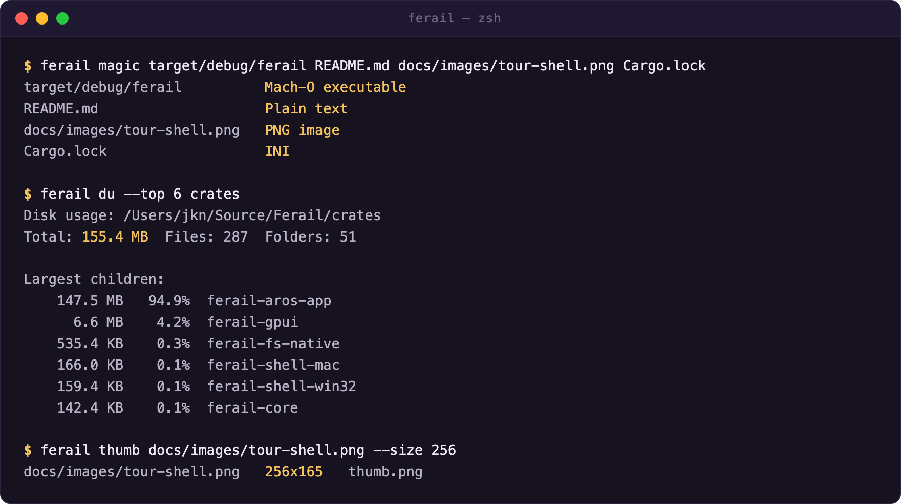

The app binary doubles as a small toolbox: `ferail magic [path]...`
prints magic-byte formats (a directory is listed shallow), `ferail formats
[--recursive] [path]...` emits path, extension, detected format, description
and the file-list policy verdict as TSV, `ferail du [--top N] <path>` a
disk-usage summary, `ferail thumb <path>` extracts a
file's thumbnail/preview to a PNG, and `ferail doctor` checks config,
storage and dependencies. Same engines as the UI: the magic table, the
disk-usage walker, the thumbnail pipeline: scriptable from a shell.

## The quiet features you'll feel

- **Dock drawer**: park the whole window against a screen edge; it
  slides away and comes back on an edge-slam, floating over every Space.
  ([dock](features/DOCK.md))
- **Resilient file ops**: copy/move/trash batches continue past
  failures and report "N of M · why" with copy/retry (and
  retry-as-administrator on macOS). ([file ops](features/FILE_OPS.md))
- **Undo that means it**: rename, bulk rename, move, copy, trash, and
  favorites edits are all reversible, with guards so an undo never
  overwrites something newer.
- **A Trash you can act in**: its own menu, and **Put Back** returns an item
  to where it came from without overwriting whatever took its place.
  ([file ops](features/FILE_OPS.md))
- **Private Mode**: a capture-safe lock that projects invented names, paths
  and blurred thumbnails so a screenshot of a real session shows the app and
  not your files. ([private mode](features/PRIVATE_MODE.md))
- **CLI + headless screenshots**: `ferail magic`, `ferail du`, and
  a screenshot harness that renders any surface off-screen (it produced
  every image on this page).

## Make it yours

Right-click menus are editable: Settings ▸ Menus lists every entry a menu
shows, with a switch on each one, rows that drag into any order, separators
you can place and remove, and a reset per menu. Hiding an entry never removes
the command; it keeps its shortcut and stays in the palette.
([context menus](features/CONTEXT_MENU.md))

Ferail ships in **English, French, German and Polish**, switchable live, and
any language can be added by exporting the catalog, translating it anywhere,
and importing it back. ([localization](features/LOCALIZATION.md))

## Editors, for the small fixes

A built-in **text editor** opens a file in its own window with find and
replace, reload from disk, wrap and line-number toggles, and a strip showing
line, column, encoding and line endings; it round-trips CRLF and BOM and
saves atomically beside the original.
([text editor](features/TEXT_EDITOR.md))

A built-in **image editor** redacts and annotates: rectangle and brush, opaque
black or coloured, undo, and a save that writes a copy beside the original
unless you confirm an overwrite. ([image editor](features/IMAGE_EDITOR.md))

## Where the project is

Per platform and per feature: **[docs/STATUS.md](STATUS.md)**.
