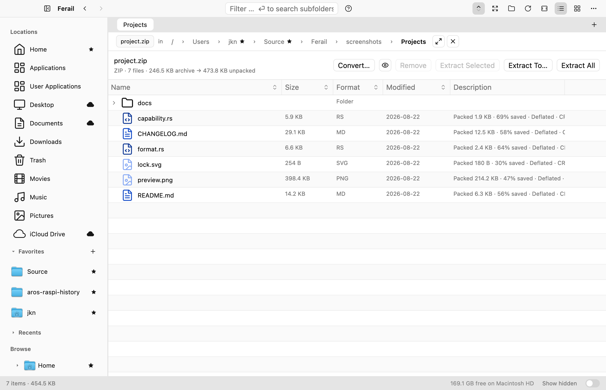

# Archives

Ferail's archive subsystem treats an archive as a browsable folder while
keeping every potentially blocking codec and filesystem operation away from
the GUI thread. This document is the detailed contract shared by the pure
archive model, native codec layer, archive workbench, drag-and-drop behavior,
and conversion command.



*The workbench browsing a ZIP: archive summary, Convert / Extract controls, and
per-entry packed size, compression method, and checksum.*

Code:

- `ferail-archive`: format identity, capability matrix, entry metadata,
  archive tree, and path-safety rules;
- `ferail-fs-native/src/archive/`: format probing, table-of-contents readers,
  extraction, creation, ZIP rewriting, progress, cancellation, and scratch
  cleanup;
- `ferail-gpui/src/archive.rs`: archive workbench, projected edits, preview,
  drag-and-drop, and Save/Revert interaction;
- `ferail-gpui/src/archive_create.rs`: new-archive dialog;
- `ferail-gpui/src/archive_convert.rs`: capability-driven conversion dialog;
- `ferail-gpui/src/shell/file_ops.rs`: background task integration and user
  notifications.

## Supported formats

Extensions are aliases; each row below is one logical format.

| Format | Browse / extract | Create new | Edit existing |
| --- | --- | --- | --- |
| ZIP | yes | yes | yes, transactionally |
| 7-Zip | yes | yes | no |
| TAR | yes | yes | no |
| TAR.GZ / TGZ | yes | yes | no |
| TAR.BZ2 / TBZ2 / TBZ | yes | yes | no |
| TAR.XZ / TXZ | yes | yes | no |
| Gzip | yes, one member | yes, one input | no |
| Bzip2 | yes, one member | yes, one input | no |
| XZ | yes, one member | yes, one input | no |
| LHA / LZH | yes | no | no |

That is ten readable formats, nine formats Ferail can create, and one format
that can safely commit entry-level edits today: ordinary ZIP.

Content probing is authoritative when an archive is opened. A file can be
browsed even when its extension is absent or misleading. ZIP-based packages
and structured documents such as DOCX, XLSX, PPTX, JAR, APK, and IPA are
intentionally protected from editing: a generic ZIP rewrite could invalidate a
signature or violate package structure. They show the same read-only lock as a
format without an editor.

The probe also looks through the first block of a lexically single-member
Gzip, Bzip2, or XZ stream. If that decoded block is a valid TAR header, Ferail
opens it as TAR.GZ/TAR.BZ2/TAR.XZ and lists the inner tree directly. This
covers duplicate-download names such as `backup.tar (1).gz`, where the browser
inserted text between `.tar` and `.gz` and extension matching alone would show
one opaque TAR member.

`Format::capabilities()` is the source of truth for UI affordances. New codecs
must add their format, capability row, tests, and translated UI behavior
together; views must not grow independent hard-coded format lists.

## Opening and browsing

**Open as Archive** is offered for every single regular file. It reads and
probes the table of contents on the background executor, then opens the
workbench docked in the current tab. This keeps menu construction free of I/O
while allowing extensionless and ZIP-based package files to work. The
workbench can be popped into its own window and docked again.

The workbench uses Ferail's normal virtualized data table rather than a bespoke
list. Archive paths are indexed into an `ArchiveTree`; implied directories are
synthesized when a format records only leaf entries. Expanding a folder
projects one additional level, so an archive with thousands of members does
not start as thousands of flat rows.

The workbench provides:

- sortable Name, Size, Format, and Modified columns;
- filtering without extracting;
- multi-selection and subtree-aware folder selection;
- Enter/double-click preview through memory or one private scratch file;
- Extract Selected, Extract To…, and Extract All;
- a packed-size → unpacked-size summary;
- a read-only lock badge whenever edits cannot be committed.

Archive member names use the same deceptive-filename analysis as filesystem
rows. Bidirectional controls, zero-width characters, unusual whitespace, and
mixed-script look-alikes are rendered as explicit highlighted spans with
tooltips. The display treatment never rewrites the stored path: extraction and
selection continue to use the literal member name after safety validation.

Primary actions use distinct icons with translated tooltips at every width.
The filter appears only when enough width remains for the archive identity and
primary actions. Extracting a lasting copy always requires an explicit Extract
command; row activation only expands or previews. Escape exits the workbench
whether it is docked or in its own window; a modified ZIP first asks whether to
save, discard, or keep editing.

## Entry metadata

The common `ArchiveEntry` model carries metadata only when the source format
and codec expose it:

- safe internal path and directory flag;
- uncompressed and compressed size;
- modification time;
- compression method;
- checksum (for example ZIP CRC-32 or LHA CRC-16);
- Unix mode;
- encrypted state;
- entry comment.

The Description column composes the useful subset: packed size, savings,
method, checksum, mode, encryption, and comment. Missing metadata remains
missing rather than being guessed. Aggregate counts and packed/unpacked totals
come from the table of contents and the archive's cached filesystem stamp.

## Extraction

Every supported format can extract all members. Multi-member formats also
support a selected subset; choosing a directory includes its complete subtree.
Single-member Gzip, Bzip2, and XZ expose one logical output file derived from
the archive name.

Extraction always runs as a background file operation with progress and
cooperative cancellation. Every member path passes through the shared
zip-slip guard. Absolute paths, drive/UNC prefixes, `..` traversal, NUL bytes,
empty paths, and other unsafe spellings never escape the destination.

Lexical validation is only the first containment layer. ZIP and TAR link
entries are never materialized; 7-Zip Unix-mode/Windows-reparse metadata and
LHA Unix-mode metadata receive the same treatment. TAR hard links, devices,
FIFOs, anti-items, and other special entries are skipped and reported. On
Unix, destination components are created and opened relative to directory
file descriptors with `O_NOFOLLOW`, including the final file. This prevents a
pre-existing link inside the chosen destination and closes the usual
check-then-open replacement race. Windows rejects every existing reparse point
and opens the final component with `FILE_FLAG_OPEN_REPARSE_POINT`. A skipped
member is visible in the operation result; conversion treats any skip as a
hard failure so it cannot silently produce an incomplete archive.

The reverse gesture works too: dropping files or folders **onto an archive
file** in the list or grid adds them to it, without opening the workbench
first. The row classifies itself by suffix only (`Format::from_path`, pure
string work: render must not probe the file), so a ZIP shows the ordinary
accent copy ring while a format that cannot be edited in place, 7z, the tar
family, single-member gz/bz2/xz, LHA: shows the forbidden cursor and danger
ring. Both consume the drop: letting a refused archive fall through to the
pane behind it would move the files into the current folder, somewhere the
user never aimed. Dropped folders bring their subtree, an entry whose name is
already present is reported rather than shadowed, and the worker re-derives
the real format before writing, so a mislabelled file fails there instead of
being corrupted. ZIP-based packages (`.docx`, `.jar`, `.apk`) are not
recognized as archives by suffix and are never offered as add targets. The
operation is deliberately not undoable: undo would need the pre-add bytes,
which are not kept. Members dragged out of *another* archive land the same way:
they are cherry-picked into a private staging directory beside the target and
appended by leaf name, and the staging directory is removed on every path.

Appending is transactional, like the workbench's Save. Existing members are
byte-copied (never re-encoded) into a sibling temp file, the additions are
written there, the result's central directory is parsed and the archive's stamp
re-checked, and only then does an atomic replace swap it in. An in-place append
would be faster, it rewrites just the central directory, but a cancellation,
vanished source, read error, or full disk part-way through would leave a
truncated member inside the user's real archive while the operation reported
failure. Duplicate names are skipped rather than shadowed, and the skip set
grows as items are written, so two dropped inputs that resolve to the same
archive path cannot both be recorded. A partly-skipped drop names what it left
alone instead of reporting a clean success.

Local filenames become archive paths through one component filter. A name is
one component by construction, but on Unix it may legitimately *contain* a
backslash, translating that to `/` would invent structure, turning the real
file `..\payload` into the entry `../payload`. Ferail's own extraction guard
would reject that, but another tool's might not, so backslashes are left alone
and any component that still fails the shared safety rule is dropped rather
than archived under a dangerous name.

Dragging archive rows onto a folder in Ferail invokes the same extraction
pipeline. It is not a second decoder path. The dropped members land in the
destination **by their leaf name**, exactly as the same drag onto Finder does:
a file becomes `dest/name`, a folder brings its subtree, and nothing is wrapped
in an extra folder named after the archive. Because extraction preserves each
member's path *inside* the archive, it runs into a private staging directory
inside the destination first and only the dragged entries are published from
there, so a member picked out of an inner folder lands beside its new siblings
instead of recreating that folder. An occupied name is deduped `name (2)`
rather than overwritten, and the staging directory is removed on every path,
including failure. Extracting a whole archive is a different gesture and still
creates the folder named after the archive. Preview also uses the same guarded
extraction primitives, writes only inside the process scratch area, caps large
entries, and relies on startup sweeping to remove abandoned scratch from a
dead process.

On macOS, dragging a member out of a standalone archive window uses native
`NSFilePromiseProvider` items. Merely starting or cancelling the drag writes
nothing. After Finder (or another promise-aware destination) accepts a real
drop, AppKit calls the promise writer on a private background operation queue.
The writer runs the same guarded extraction into a private directory on the
destination volume and atomically renames the completed member to Finder's
promised path; errors never publish a truncated-looking file. Multiple equal
leaf names are disambiguated without changing their archive paths.

Another Ferail window receives the same native gesture without first
materializing a temporary file. AppKit only delivers a drag to a window
registered for a type that is on the session pasteboard, and GPUI registers its
windows for the legacy filename list alone, which a promise never carries, so
by default a Ferail window is not a destination at all. Ferail's promise items
are therefore an `NSFilePromiseProvider` subclass that also declares a private,
pathless marker type, and every Ferail window is registered for that marker at
drag start, before `beginDraggingSession` (this ordering matters when the
standalone workbench overlaps its parent and the pointer is already over the
underlying window as the session begins). The macOS window boundary then
recognizes the promised-file session without invoking GPUI's legacy filename
parser, while the real archive coordinates remain an in-process payload.
Finder ignores the marker. Dropping on the main list/grid background uses
that window's current folder. Folder rows, grid cells, Browse-tree folders,
volumes, available path favorites, sidebar Locations, and breadcrumb segments
highlight and extract into the targeted folder; expandable targets keep the
ordinary spring-load behavior. Every one of those targets works whether the
workbench is popped out or docked: docked, the workbench covers the file list,
so the sidebar and breadcrumb are the destinations that remain reachable, and a
release over the workbench itself stays a cancelled drag. During a native promise session GPUI owns no typed drag,
so `drag_over` never fires: every one of those targets paints its accent ring
from a plain hover style instead, refreshed by the `on_mouse_move` that the
platform delivers. GPUI allows a single `.hover()` per element, so each target
merges its ordinary hover wash and this drop ring into one closure, adding a
second `.hover()` is a debug assertion, not a style that loses. Every path
invokes the same background extraction pipeline. No placeholder path is
advertised, so Finder cannot receive an extra dummy file. Session completion
and Escape clear both the AppKit session and the in-process drag state. Native
`draggingExited:` callbacks for this marked session deliberately preserve the
payload while it crosses a window edge or gap; otherwise GPUI discards the
typed drag before re-entry or drop. Consequently the forbidden feedback also
returns when a drag leaves and re-enters its source archive.

Dropping a member back on its source archive is explicitly forbidden and
consumes the event, so a docked workbench cannot accidentally bubble the drop
into the underlying folder's “extract here” target.

## Creating archives

The create dialog offers the multi-file formats returned by
`Format::creatable_multi_file()`: ZIP, 7-Zip, TAR, TAR.GZ, TAR.BZ2, and TAR.XZ.
Single-member Gzip, Bzip2, and XZ are reached through the one-file Compress
action. LHA/LZH is absent because the bundled backend decodes but does not
encode it.

Input enumeration, reading, compression, and output writes are background
work. The dialog shows compression levels only where the chosen writer honors
them and password controls only where encryption-on-create is implemented.
Creation never relies on the filename extension as proof that a writer can
handle a format.

## Staged ZIP editing

Only a file whose explicit format is ordinary `.zip` may enter edit mode.
Dropping files or folders into the workbench, or onto one of its inner
folders, adds an `ArchiveAddition` to an in-memory journal. Rename and Remove
add journal operations as well. The visible table of contents is a pure
projection of the original entries plus that journal; the source archive is
untouched until **Save Changes**.

The header shows the number of pending changes and exposes:

- **Save Changes**: commit the complete journal once;
- **Revert**: abandon every pending operation;
- close protection in a standalone window: Save Changes, Discard Changes, or
  Keep Editing.

Removing a not-yet-saved addition cancels that addition rather than recording
a phantom removal. Renames apply to complete subtrees, preserve path-component
boundaries, and reject collisions before commit.

### Transactional commit

Save performs this sequence off the UI thread:

1. compare the current size and modification stamp with the stamp captured
   when the workbench loaded;
2. expand staged filesystem additions;
3. create a unique sibling temporary ZIP with `create_new`;
4. raw-copy unchanged ZIP members so their compressed bytes, encryption,
   timestamps, modes, comments, extra fields, and checksums survive;
5. apply removals and renames and stream additions into the writer;
6. sync the output and copy source permissions and supported extended
   attributes;
7. reopen the temporary archive and validate its central directory and entry
   count;
8. check cancellation and compare the source stamp again, closing the race
   with another application modifying the archive during a long rewrite;
9. atomically replace the original.

Any cancellation, collision, stale-source detection, read/write error, codec
error, or validation failure drops the temporary file and leaves the original
byte-for-byte untouched. ZIP-based packages fail before a rewrite begins.

## Drag-and-drop feedback

The workbench accepts additions only when `can_stage_edits()` confirms a loaded
ordinary ZIP that is not currently saving. Accepted drag targets show Copy.
Read-only formats and protected packages show the forbidden cursor and a
localized explanation; the lock badge keeps that constraint visible even when
no drag is active.

Drop-source inspection can enumerate directories, so it runs in a background
task. Hover and render paths use cached state only. This is part of the Prime
Directive contract, not a performance optimization that callers may bypass.
Outbound archive promises follow the same rule: the GUI thread constructs
only names, directory flags, and callbacks from the cached table of contents;
AppKit schedules decoding and destination I/O after the external drop.

## Passwords and encrypted archives

An encrypted table of contents or member prompts for a password without
blocking the window. Passwords live only in the workbench/task state needed for
that operation and are passed to the codec on the worker. Wrong and missing
passwords are distinct archive errors where the backend can distinguish them.

Editing an encrypted ZIP raw-copies unchanged encrypted members. New entries
use the selected ZIP creation options. Conversion treats input and output
passwords as separate choices and never silently reuses the source password.

## Prime Directive

No GUI handler, render method, drag-hover callback, or foreground future may
stat, open, enumerate, decode, extract, compress, rewrite, remove, or download.
Public native archive operations call `assert_off_ui_thread`. UI code creates a
background task, receives progress/results through the normal task machinery,
then mutates entities and notifications on the foreground executor.

Scratch cleanup is also background work. A synchronous `Drop` implementation
must not remove preview files because entity destruction can occur on the GUI
thread; abandoned paths are handled by task completion or the startup sweep.

## Convert Archive…

Conversion is available from an archive row's context menu and from the open
archive workbench. It offers every creatable multi-file format from the
capability matrix: ZIP, 7-Zip, TAR, TAR.GZ, TAR.BZ2, and TAR.XZ, with ZIP
selected by default. LHA/LZH and the single-member stream formats remain
source-only in this dialog.

The picker shows the detected source, editable output stem and live extension,
destination format, supported compression choices, separate source and output
passwords, and metadata-loss/package warnings. Output encryption is displayed
only for a writer that implements it. Conversion is disabled while the
workbench has staged changes; the user must Save or Revert first, so the
meaning of the source snapshot is unambiguous. The source is never replaced.

The implementation reuses the existing codecs:

```text
source archive
    → guarded extraction into a private 0700 sibling staging directory
    → create a private partial with the selected writer
    → reopen and validate the result
    → atomically publish to a final unused destination
```

The worker snapshots the source before extraction and checks it again before
creation. Any unsafe, linked, unsupported, duplicate, or otherwise skipped
member aborts conversion instead of disappearing. It validates the new table
of contents and file count, syncs the partial, and publishes with a hard link:
publication is atomic and cannot clobber a name won by another process. Name
collisions choose `name 2.ext`, `name 3.ext`, and so on. Cancellation or any
failure removes staging and the partial output through RAII cleanup.

Archive comments, original compression methods, checksums, ACLs, ownership,
extended attributes, sparse layout, signatures, and metadata unsupported by
either side may not survive. Structured ZIP packages may be converted only as
an explicit plain-archive copy; the dialog warns that the result may no longer
work as an application or document.

## Localization and documentation rule

Every archive string visible to a user, labels, tooltips, drop rejection,
password errors, warnings, progress, and results, must use the i18n macros.
After adding or changing text, regenerate `locales/en.json`, translate every
new key in bundled German and French, then run extraction and language-pack
validation. English is the fallback, not permission to leave bundled packs
incomplete.

## Verification

The archive test layers cover:

- format detection, capability rows, tree projection, and zip-slip rejection;
- pre-existing destination directory/file symlinks and codec link metadata;
- deceptive archive-name projection through the shared hazard renderer;
- TOC and extraction behavior for every codec family;
- create/extract round trips;
- staged ZIP add, rename, and removal in one commit;
- cancellation and stale-source protection leaving the original unchanged;
- protected ZIP containers remaining browseable but byte-identical;
- all six conversion targets, validation, collision naming, cancellation,
  unsafe-member refusal, cleanup, and source preservation;
- metadata propagation;
- projected path/removal/addition behavior in the workbench;
- icon resolution and rendered archive screenshots;
- strict clippy UI-thread syscall guards.

When a new archive format or operation lands, update this document, the
capability matrix, bundled translations, and tests in the same change.
